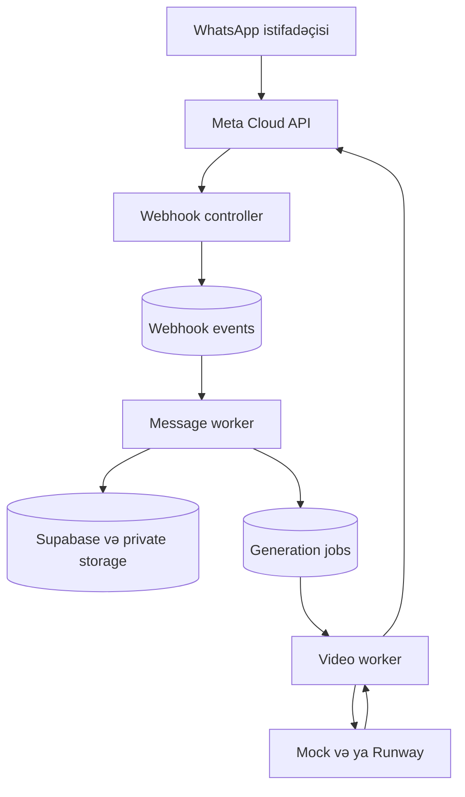

# Arxitektura

## Axın

1. İstifadəçi məhsul şəklini göndərir.
2. Backend şəkli private storage-a yazır və qısa təsvir istəyir.
3. Mətn gəldikdə `generation_jobs` cədvəlinə iş əlavə olunur.
4. Video worker şəkli və prompt-u seçilmiş providera göndərir.
5. Nəticə dərhal storage-a kopyalanır və Meta media API vasitəsilə istifadəçiyə ötürülür.

## Komponentlər

- `WhatsAppController`: verify və imzalı webhook qəbul edir.
- `WhatsAppWebhookWorker`: gələn hadisələri asinxron emal edir.
- `WhatsAppProcessorService`: dialoq vəziyyətini və əmrləri idarə edir.
- `GenerationWorkerService`: video işini başladır, nəticəni saxlayır və göndərir.
- `VideoProviderService`: `mock` və `runway` adapteridir.
- `DataStoreService`: Supabase aktiv deyilsə in-memory fallback verir.
- `MediaStoreService`: Supabase Storage aktiv deyilsə lokal fallback verir.

## Hazırkı məhdudiyyətlər

- In-memory rejim restart zamanı məlumatı itirir.
- Polling worker bir instanslı ilkin MVP üçündür.
- Ödəniş, istifadəçi limiti, admin paneli və kontent moderasiyası ayrıca mərhələdir.
